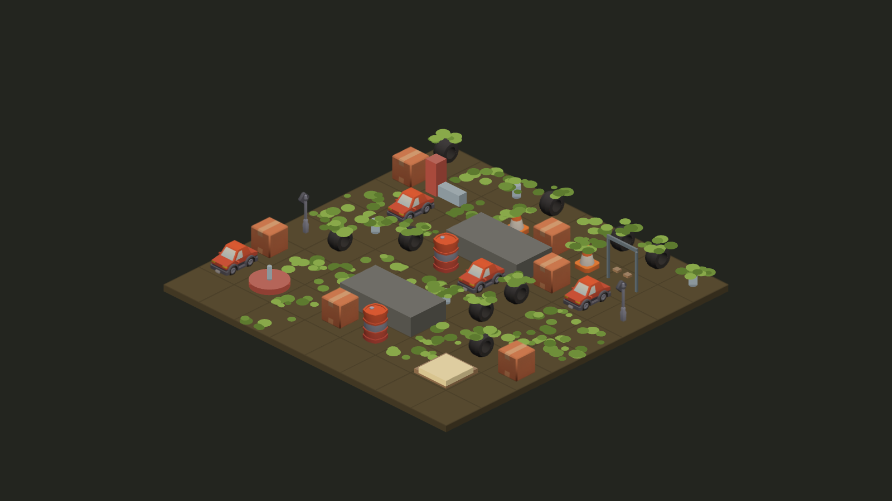

# Afterlife

A calm isometric web game about nature reclaiming abandoned places. Plant seeds among the ruins, drop scrap to feed them, and watch moss, vines, flowers and bamboo take the scene back.

> Play it: **(live link added at launch)** · v1 complete: 5 places, generative soundtrack, Kenney props.

## How it plays

- Placing scrap makes every plant within its ring grow one step. Small scrap reaches 1 tile, medium 2 and large 3.
- Grown moss and vines spread, flowers bloom (tap a bloom for a seed), and bamboo grows tall.
- Fill the meter by covering the scene, including the scrap you've placed. There's no timer and no losing, and you can always undo.

## Development

    npm install
    npm run dev         # play locally at http://localhost:5173/play/
    npm test            # rules engine + level solvability tests
    npm run typecheck
    npm run solve -- src/levels/01-bus-stop.json   # regenerate a level's reference solution
    npm run sprites     # re-render Kenney props (needs npm run dev running)
    npm run hero        # re-capture the landing hero and share images (needs npm run dev)

The rules live in `src/engine/`, pure TypeScript with no framework. Levels are JSON files in `src/levels/`.

## Credits

- Design and direction: Ujjwal Kumar
- Inspired by the mechanics of *Cloud Gardens* by Noio. Afterlife uses no names, art, levels or audio from it.
- Props rendered from [Kenney](https://kenney.nl) CC0 3D models (licence in assets/LICENSES/); plants and ground are drawn in code.
- Soundtrack generated live with Tone.js.

## Licence

Code: MIT (see `LICENSE`). Third-party art keeps its own licence.
