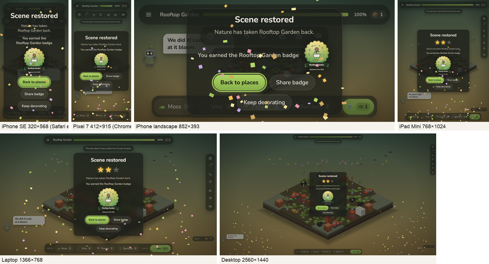
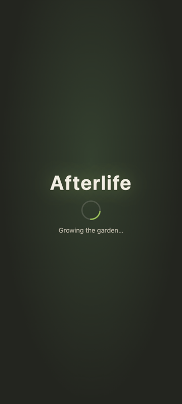

# Afterlife — Pre-Launch Test Report

*Version 1.6.0 · Build `a2b0fad` · https://afterlifeme.vercel.app · Tested 3 October 2026 · Prepared for Ujjwal Kumar (Director) by Claude (Builder/QA)*

## 1. Launch decision

<div class="verdict">

**✅ OK TO LAUNCH.** All nine test types were run against Afterlife v1.6.0, and every one passed.

- No defects are open.
- 4 defects were found and fixed during this campaign (§11).
- Three things are not verified yet, and none of them blocks launch: a check on your own phones, real-player playtesting, and Firefox. They are listed as launch-week actions (§12).

</div>

| # | Test type | What was done | Result |
|---|---|---|---|
| 1 | Combinatorial (pairwise) | 32 generated cases covering all 232 value pairs of 7 factors (2,048 full combinations) | **32/32 pass** |
| 2 | Cleanroom (spec-driven, static analysis, statistical usage) | 6 specs and 6 plans; strict TypeScript; dependency audit; independent reviews; 2,000 random games / 119,400 moves with rule checks | **0 type errors, 0 vulnerabilities, 0 rule violations** |
| 3 | Functionality | 19-item feature checklist in 2 browser engines plus 374 automated tests | **38/38 + 374/374 pass** |
| 4 | Compatibility & performance | 14 devices and screen sizes × 2 engines; frame rate at 4× and 6× slower CPU; memory; page load | **28/28 pass, 60 fps, no memory growth** |
| 5 | Tree (navigation) | Crawled every menu screen; 14 common tasks timed in clicks | **All screens 1 click from the title, no dead ends** |
| 6 | Regression | Full automated suite, including tests written for each past bug, re-run after every change | **374/374 pass** |
| 7 | Ad hoc (exploratory and monkey) | 1,200 random actions (taps, clicks, keys, drags, resizes) plus 10 edge cases, in 2 engines | **0 errors, 20/20 edge cases pass** |
| 8 | Load | Up to 50 concurrent visitors, 2,550 requests to the live site | **0 failed requests** |
| 9 | Play testing (simulated) | 3 player personas × 8 places (random, greedy, hint-follower) | **Every place can be finished; balance notes in §11** |


## 2. Scope and test environment

- **Product.** Afterlife is a single-player web game (HTML5 and WebGL) with no accounts, servers or online services.
  - Progress is stored only in the player's own browser.
  - It is hosted as static files on Vercel's global network (CDN).
- **What was tested:**
  - 8 places;
  - the story intro;
  - the tutorial;
  - hints (3 per place, with a star penalty);
  - undo and restart;
  - board turning (buttons, Q/E keys, swipe) and zoom;
  - How to Play;
  - Settings (sound, volume, Reduce motion, vibration, Reset game);
  - stars;
  - badges and sharing;
  - celebrations (confetti and vibration);
  - saving.
- **Browser engines:**
  - **Chromium:** Google Chrome, which also covers Edge, Samsung Internet, Opera and Android browsers.
  - **WebKit 26.6:** the Safari engine, used by Safari on Mac and by every browser on iPhone and iPad.
  - Firefox could not be launched in the test lab (see §12).
- **Tools:**
  - Vitest 5 for unit and integration tests;
  - Playwright for browser automation;
  - Chrome DevTools Protocol for CPU and network throttling and memory;
  - a custom pairwise generator;
  - a custom statistical game fuzzer.
- **Scripts** are in `tools/qa/` in the repository, so the campaign can be repeated.

## 3. Combinatorial testing (pairwise)

**Why pairwise:** testing every combination of these factors would take 2,048 runs. Most combination bugs are triggered by two factors interacting, so the generator picked **32 cases that together cover every pair of values** (232 pairs).

| Factor | Values |
|---|---|
| Browser engine | Chromium, WebKit |
| Device / orientation | Phone portrait 390×844, phone landscape 844×390, tablet 768×1024, desktop 1366×768 |
| Save state | New player, existing progress, corrupted save, storage blocked (private mode) |
| Sound | On, off |
| Motion | Normal, Reduce motion |
| Vibration | On, off |
| Place | All 8 |

**Each case checked that:**

- the place can be finished;
- confetti appears only with normal motion;
- the phone buzzes only when vibration is on;
- the mute button matches the setting;
- the win panel fits the screen and shows the badge;
- the win is saved (unless storage is blocked);
- the game reloads cleanly;
- there are no console errors.

**Result: 32/32 pass.**

## 4. Cleanroom testing

This is the cleanroom approach: write a formal specification first, check the code before running it, and certify it with statistical testing.

- **Formal specifications.**
  - Every version was built from a written spec (6 specs) and a step-by-step plan (6 plans), in `docs/superpowers/`.
  - Each requirement maps to named automated tests. Examples: the hint star cap → `starsFor with hints`; Reset game → `Reset game (Settings)`; badges → `v1.6 celebrations and badges`.
- **Incremental development.**
  - The game grew in small releases (v1 → v1.6).
  - Each step was written test-first: a failing test first, then the code.
- **Static analysis:**
  - TypeScript in `strict` mode: **0 errors**.
  - `npm audit` of every library the game uses: **0 vulnerabilities**.
  - Production build: clean, with no warnings other than the known large-bundle note.
- **Independent review.** Before every major release, a separate reviewer that had not seen the code before read the whole change. Every important finding was fixed with a test first.
- **Statistical usage testing.**
  - **2,000 complete games** were played with random legal moves (250 per place), including undos: **119,400 moves**.
  - **Rules checked after every move:**
    - no crash;
    - the coverage and progress meters stay between 0 and 100%;
    - seed counts are never negative;
    - the screen and the rules engine agree;
    - a won place stays won;
    - "The garden rests" appears only when no move is really left.
  - **Rules checked after every game:**
    - replaying the same moves gives an identical result (deterministic);
    - Restart returns exactly to the start.
  - **Result: 0 violations.**

## 5. Functionality testing

**Automated unit and integration suite: 374/374 tests pass.** By area:

- the game screens and app flow: 77;
- the rules engine: 64;
- game logic (hints, stars, Pip, tutorial): 65;
- rendering helpers: 56;
- interface: 69;
- levels (each proven solvable): 18;
- saving: 17;
- audio: 8.

**Feature checklist, driven through the real interface in both engines:**

| ID | Feature | Chromium | WebKit |
|---|---|---|---|
| F1 | Title shows the logo and 6 menu buttons | ✅ | ✅ |
| F2 | First Play opens the story; captions advance; Skip leads to the places | ✅ | ✅ |
| F3 | Story replays from the title; Esc closes it back to the title | ✅ | ✅ |
| F4 | Places screen: 8 cards, only the first unlocked on a new game | ✅ | ✅ |
| F5 | Bus Stop starts the guided tutorial; Skip tutorial ends it | ✅ | ✅ |
| F6 | Tap plants a seed; Undo takes it back; Restart clears the board | ✅ | ✅ |
| F7 | The board turns with the buttons, Q/E keys and a sideways drag | ✅ | ✅ |
| F8 | Mouse wheel zooms the camera | ✅ | ✅ |
| F9 | Hint: count goes 3 to 2, a tile glows, Pip explains | ✅ | ✅ |
| F10 | How to Play opens from ?, closes with Esc, focus returns to ? | ✅ | ✅ |
| F11 | Mute toggles and is remembered | ✅ | ✅ |
| F12 | Win: panel with stars and badge; Share badge downloads the PNG on a computer | ✅ | ✅ |
| F13 | Keep decorating closes the panel; Next place opens Rooftop | ✅ | ✅ |
| F14 | Badges screen shows 1 of 8 earned with a Share button | ✅ | ✅ |
| F15 | Settings: volume, reduce motion and vibration are saved and applied | ✅ | ✅ |
| F16 | Credits name the designer and Kenney | ✅ | ✅ |
| F17 | Keyboard only: Tab to Play and Enter starts | ✅ | ✅ |
| F18 | Reset game: asks first, then erases everything | ✅ | ✅ |
| F19 | Locked places cannot be opened | ✅ | ✅ |


**Note on F17 in Safari:** Safari on a Mac moves keyboard focus between buttons with Option+Tab, unless "Press Tab to highlight each item" is turned on in Safari's settings. That's standard Safari behaviour, not a game issue.

## 6. Compatibility and performance testing

**Each of the 14 devices and screen sizes was tested in both engines.** On every one the test:

- opened every screen and checked for sideways scrolling;
- checked that every button is on screen, at least 40 px, and not covered;
- made real taps on tiles and checked they landed on the right one;
- played 3 places to the win panel (including the largest, Rooftop Garden);
- watched for console errors.

| Device / size | Chromium | WebKit |
|---|---|---|
| iPhone SE (320x568) | ✅ taps 9/9, wins 3/3 | ✅ taps 9/9, wins 3/3 |
| iPhone SE 3 (375x667) | ✅ taps 9/9, wins 3/3 | ✅ taps 9/9, wins 3/3 |
| iPhone 15 (393x852) | ✅ taps 9/9, wins 3/3 | ✅ taps 9/9, wins 3/3 |
| iPhone 15 Pro Max (430x932) | ✅ taps 9/9, wins 3/3 | ✅ taps 9/9, wins 3/3 |
| iPhone landscape (852x393) | ✅ taps 9/9, wins 3/3 | ✅ taps 9/9, wins 3/3 |
| Galaxy S8 (360x740) | ✅ taps 9/9, wins 3/3 | ✅ taps 9/9, wins 3/3 |
| Pixel 7 (412x915) | ✅ taps 9/9, wins 3/3 | ✅ taps 9/9, wins 3/3 |
| iPad Mini (768x1024) | ✅ taps 9/9, wins 3/3 | ✅ taps 9/9, wins 3/3 |
| iPad Pro 11 landscape (1194x834) | ✅ taps 9/9, wins 3/3 | ✅ taps 9/9, wins 3/3 |
| Laptop 1280x800 | ✅ taps 9/9, wins 3/3 | ✅ taps 9/9, wins 3/3 |
| Laptop 1366x768 | ✅ taps 9/9, wins 3/3 | ✅ taps 9/9, wins 3/3 |
| Desktop 1920x1080 | ✅ taps 9/9, wins 3/3 | ✅ taps 9/9, wins 3/3 |
| Desktop 2560x1440 | ✅ taps 9/9, wins 3/3 | ✅ taps 9/9, wins 3/3 |
| Small window 800x600 | ✅ taps 9/9, wins 3/3 | ✅ taps 9/9, wins 3/3 |




**Performance (frame rate while playing whole levels plus the win celebration):**

| Scenario | Result |
|---|---|
| Mid-range Android phone (Pixel 7 screen, CPU slowed 4×), places 5, 7, 8 | 60 fps average, slowest frame 17 ms, 0% slow frames |
| Low-end Android phone (360×740, CPU slowed 6×) | 60 fps; the game engine's own counter showed a minimum of 59 |
| Safari engine, iPhone 15 screen, Rooftop Garden | 60 fps, minimum 60 |
| Desktop 1920×1080 | 60 fps |
| Memory after 1 playthrough of all 8 places vs after 3 | 26.0 → 26.3 MB, so no build-up over long sessions |
| Check that the slowdown was real | A test loop ran 3.5× slower while throttled |

**Loading (live site, phone with CPU slowed 4×):**

| Connection | Landing page | Game page |
|---|---|---|
| 4G (9 Mbps) | First paint 0.8 s, 177 KB | Game ready 1.7 s, 820 KB |
| Slow 4G (1.6 Mbps) | First paint 0.5 s, largest paint 1.3 s | Loading screen at 0.5 s (was 4.8 s blank before the fix); game ready about 3 s |

{width=16%}

## 7. Tree testing (navigation)

The menu was crawled automatically from the title screen.

```
Title ─┬─ Play ──────────── Places (8 cards) ── a place ── win panel ─ Next place / Share badge / Keep decorating
       ├─ How to Play ───── 5 cards, Replay tutorial
       ├─ Story ─────────── 25 s intro (Skip, Esc)
       ├─ Badges ────────── 8 badges, Share
       ├─ Settings ──────── Sound, Volume, Reduce motion, Vibration*, How to play, Reset game
       └─ Credits
In a place: ☰ places · ? help · 💡 hint · ↶ undo · ⟲ restart · turn ◀ ▶ · mute     (*shown only where the device can vibrate)
```

- Every screen is **1 click from the title**, and every screen has a way back. **No dead ends.**

| Task | Clicks | Path | Reached |
|---|---|---|---|
| Start playing a place | 2 | `[data-nav="select"] → [data-level="1"]` | ✅ |
| Change the volume | 1 | `[data-nav="settings"]` | ✅ |
| Turn vibration or motion off | 1 | `[data-nav="settings"]` | ✅ |
| Watch the story again | 1 | `[data-nav="story"]` | ✅ |
| See my badges | 1 | `[data-nav="badges"]` | ✅ |
| Share a badge | 2 | `[data-nav="badges"] → [data-share-badge="bus-stop"]` | ✅ |
| Learn how to play | 1 | `[data-nav="howto"]` | ✅ |
| Reset the whole game | 3 | `[data-nav="settings"] → [data-action="reset-ask"] → [data-action="reset-cancel"]` | ✅ |
| Get a hint (in a level) | 1 | `[data-action="hint"]` | ✅ |
| Undo (in a level) | 1 | `[data-action="undo"]` | ✅ |
| Turn the board (in a level) | 1 | `[data-action="rotate-left"]` | ✅ |
| Open help (in a level) | 1 | `[data-action="help"]` | ✅ |
| Mute (in a level) | 1 | `[data-action="mute"]` | ✅ |
| Back to places (in a level) | 1 | `[data-action="menu"]` | ✅ |


**Limit:** a classic tree test asks real participants to find things. This automated version proves the paths exist and are short; §12 recommends a 5-person check.

## 8. Regression testing

- **The full automated suite runs after every change, and before every release (v1 to v1.6).** Current result: **374/374**.
- **It includes tests written to reproduce bugs fixed in earlier versions,** so those bugs can't quietly come back:
  - win toast and meter glow expiring;
  - Pip's line surviving screen redraws;
  - the story never navigating after you leave it;
  - restart not refunding hints, and clearing a shown hint;
  - no nudge over a paid hint;
  - keyboard focus kept across redraws;
  - double-tap on Share;
  - one celebration per attempt;
  - the sprout drawing position;
  - the Laundromat hint wording;
  - the Reset game confirmation and Esc;
  - storage blocked;
  - corrupted saves;
  - sound-engine errors not stopping play;
  - the bonus-pack rules;
  - a beginner who only follows hints finishing every place.
- The browser campaigns (compatibility, pairwise, functional, tree and ad hoc) are saved in `tools/qa/` and can be re-run before each release.

## 9. Ad hoc testing (exploratory and monkey)

**Monkey test:** 600 random actions per engine.

- **Mix of actions:** 267 button clicks, 184 board taps, 63 key presses, 41 drags, 22 window resizes and 23 scroll-wheel zooms.
- **Result:** **0 errors**, and the game always recovered to the title.

**Edge cases (both engines):**

| Edge case | Chromium | WebKit |
|---|---|---|
| Double-click Next place goes forward exactly one place | ✅ | ✅ |
| Spamming Undo 50× at the start does nothing harmful | ✅ | ✅ |
| Window resized during the win celebration keeps the panel on screen | ✅ | ✅ |
| Rotating the board during the celebration does not break it | ✅ | ✅ |
| Leaving a level mid-celebration and starting another works | ✅ | ✅ |
| Reload in the middle of a level restarts cleanly | ✅ | ✅ |
| Corrupted save is ignored and the game starts | ✅ | ✅ |
| Very old save (no new fields) loads and keeps progress | ✅ | ✅ |
| Hint pressed with no hints left and during the tutorial is refused | ✅ | ✅ |
| Story skipped instantly then Play again goes straight to places | ✅ | ✅ |


## 10. Load testing

- **What "load" means here.** Afterlife has no game server: everything runs in the player's browser, and the files come from Vercel's global CDN. So the load test checks how well the site serves files when many players arrive at once.

| Concurrent visitors | Requests | Failed | Median | 95th percentile | Throughput |
|---|---|---|---|---|---|
| 10 | 300 | 0 | 80 ms | 669 ms | 60 req/s (80.1 MB in 5.0 s) |
| 25 | 750 | 0 | 142 ms | 1533 ms | 71 req/s (200.3 MB in 10.6 s) |
| 50 | 1,500 | 0 | 199 ms | 3037 ms | 77 req/s (400.6 MB in 19.4 s) |


- **0 failures.** The slower 95th-percentile times at 50 visitors reflect the test machine's own internet connection: it was downloading 400 MB in 19 s.
- **Caching.**
  - **Fix made during the campaign:** the game's code files have names that change whenever their content changes, so they are now cached for a year (`immutable`). Returning players start faster.
  - Sprites are cached for a day.
  - Pages always re-check, so a new release reaches players straight away.
- **Inside the game (the device side):** three back-to-back playthroughs of all 8 places showed no memory growth, and texture use stays stable at 134 textures (§6).

## 11. Play testing (simulated) and balance

- **Simulated players.** Three automated players played every place:
  - **Random:** random legal moves, with some undos.
  - **Greedy:** always the move that covers the most right now.
  - **Hint-follower:** only ever does what the 💡 hint suggests.
- **No real players yet.** Real-player playtesting has not happened; see the recommendations.

| Place | Random player: restored | Random: avg moves | Greedy player | Hint-follower |
|---|---|---|---|---|
| Bus Stop | 39% | 41 | stuck (rests) | ✅ restored (31 moves, 2 bonus packs) |
| Rooftop | 38% | 48 | restored | ✅ restored (29 moves, 0 bonus packs) |
| Petrol Station | 4% | 76 | restored | ✅ restored (56 moves, 7 bonus packs) |
| Railway Platform | 2% | 49 | stuck (rests) | ✅ restored (33 moves, 0 bonus packs) |
| Playground | 8% | 63 | stuck (rests) | ✅ restored (47 moves, 2 bonus packs) |
| Laundromat | 1% | 57 | stuck (rests) | ✅ restored (52 moves, 6 bonus packs) |
| Bus Depot | 14% | 49 | restored | ✅ restored (40 moves, 2 bonus packs) |
| Rooftop Garden | 0% | 62 | stuck (rests) | ✅ restored (57 moves, 6 bonus packs) |


**Findings:**

- **Every place can be finished.** The hint-follower restored all 8. The bonus pack prevents true dead ends caused by running out of scrap.
- **Careless play often hits "The garden rests".** A random player restores places 0–39% of the time, and the greedy strategy also gets stuck on 5 of 8 places. The game handles this kindly (Undo or Restart, with no penalty), but the deeper places (Petrol Station onwards) are a real puzzle.
  - **This is the main question for real playtesting:** is that the right amount of challenge for the cozy audience?

**Defects found and fixed during this campaign:**

| # | Defect | Severity | Fix | Verified by |
|---|---|---|---|---|
| D1 | On 320 px phones (iPhone SE 1st gen), Help and Mute were pushed off-screen once Hint made 7 tools | Major | Tools are 40 px on screens under 350 px | Compatibility re-run 28/28 |
| D2 | On Slow 4G the game page was blank for about 4.8 s while downloading | Major (perceived as broken) | Instant built-in loading screen | Live re-measure: 0.5 s; test `boot.test.ts` |
| D3 | Build files were re-checked on every visit (no long cache) | Minor (speed for returning players) | One-year immutable cache for hashed files | Live headers confirmed; test `caching.test.ts` |
| D4 | On Mac desktop, Share badge opened the system share menu instead of downloading | Minor | Computers download; phones and tablets share | Live: download plus phone share sheet confirmed |

**Not defects:** two checklist failures (F1, and F17 in Safari) were mistakes in the test script. Both were corrected and re-run.

## 12. Known limitations (not verified in the lab)

- **Real phones.**
  - Vibration, the native share sheet (especially the iPhone share sheet with an image) and real phone GPUs were simulated, not tried on hardware.
  - **Action:** a 15-minute smoke test on your own iPhone and an Android phone (§13).
- **Firefox.**
  - Playwright's Firefox build would not start on this Mac's operating system (macOS 27).
  - The game uses only standard web features that Firefox supports.
  - **Action:** open the game once in Firefox desktop and on Android.
- **Real players.**
  - Simulated players can't judge fun, clarity or difficulty.
  - **Action:** a short playtest with 5–8 people (§13).
- **Screen readers.**
  - Labels, live regions and focus handling are tested automatically; a manual pass is still worthwhile.
  - **Action:** a manual pass with VoiceOver (iPhone) and TalkBack (Android).

## 13. Recommendations

| Priority | Recommendation | Why |
|---|---|---|
| **Launch day** | Device smoke test (15 min) on your iPhone and Android: open the link, Play → story → Skip, finish Bus Stop, feel the buzz (Android), tap **Share badge**, use a 💡 hint, open Settings → Vibration/Reset (Cancel), rotate the phone sideways | Covers the four things the lab can't: real vibration, the share sheet, touch feel and phone GPUs |
| **Launch week** | Playtest with 5–8 people who haven't seen the game. Watch silently for 15 min, then ask: *What was confusing? When did you want to quit? Did the hint feel fair? Would you share the badge?* | The main open question is the difficulty from Petrol Station onwards (§11) |
| **Launch week** | Watch the Vercel Speed Insights dashboard daily, and look at the real-user scores on phones | Confirms the lab performance numbers with real players |
| Soon | Add automatic testing on GitHub (run the 374 tests on every push) | Stops a future change from breaking the live game |
| Soon | Open the game once in Firefox (desktop and Android) | Closes the one browser gap |
| Soon | If playtesters find the later places hard, add a gentle prompt such as "Try Undo — or tap the bulb" when "The garden rests" first appears, or make that place's target slightly lower | Keeps the cozy promise without making it trivial |
| Later | Split the game code so the first screen loads before the game engine (394 KB compressed today) | Faster first load on slow networks |
| Later | Pre-render the badge image as the win panel opens | Protects the iPhone share sheet if the image takes long to make |
| Later | Simple error reporting (count crashes from real players) | Without it you only hear about problems if players tell you |

## 14. Confirmation

<div class="verdict">

**Afterlife v1.6.0 is OK to launch.**

- Every planned test passed.
- All 4 defects found during testing are fixed and verified.
- Nothing is open that would stop a player from finishing the game, on any phone, tablet or computer tested.
- The launch-day device smoke test and the launch-week playtest are recommended follow-ups, not blockers.

</div>

**Sign-off:**

- **QA / build:** Claude, 3 Oct 2026.
- **Launch approval:** Ujjwal Kumar, Director (to sign).

